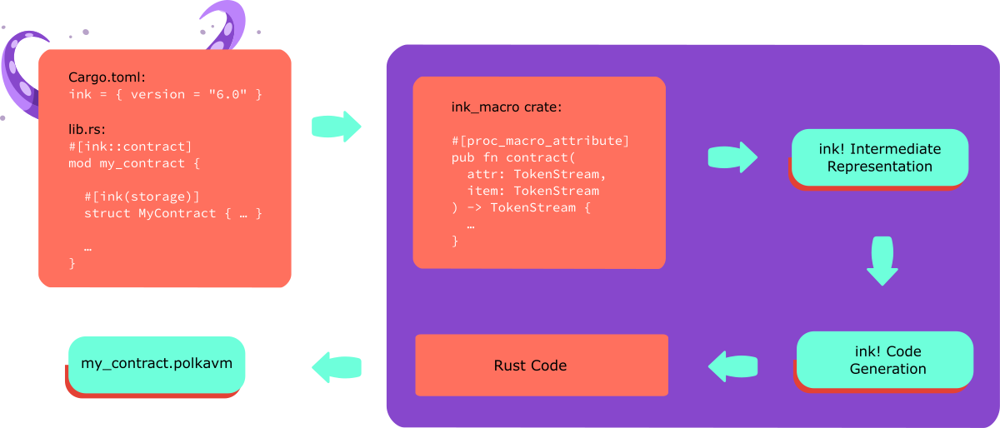

# ink!ternals

This document describes the architecture of ink!. The information
here targets those who want to understand or modify the inner
workings of this project.

In general we treat documentation as a first-class citizen.
All crates mentioned below should be documented really well.
You can find the crate documentation on docs.rs or for our
`master` branch under GitHub pages. So for `ink_lang` e.g.:

* [https://docs.rs/ink_lang/latest/ink_lang](https://docs.rs/ink_lang/latest/ink_lang) (latest)
* [https://paritytech.github.io/ink/ink_lang](https://paritytech.github.io/ink/ink_lang) (`master`)

ink! is composed of a number of crates that are all found in the
`crates/` folder. On a high-level those can be grouped as:

* `lang`: The ink! language itself.
* `allocator`: The allocator used for dynamic memory allocation in a contract.
* `engine`: An off-chain testing engine, it simulates a blockchain
   environment and allows mocking specified conditions.
* `env`: Serves two functions
  * Exposes environmental functions, like information about the caller
    of a contract call, getting random entropy, or e.g. self-terminating the
    contract.
  * Provides the connection to the [`pallet-contracts`](https://github.com/paritytech/substrate/tree/master/frame/contracts),
    so anything that calls into the underlying execution engine of the smart contract.
    This includes getting and setting a smart contracts storage, as well
    as the mentioned environmental functions.
* `metadata`: Describes the contract in a platform agnostic way, i.e.
  its interface and the types, its storage layout, etc..
* `prelude`: Provides an interface to typical standard library types and
  functionality (like `vec` or `string`). Since contracts are run in a
  `no_std` environment we provide this crate as an entrypoint for accessing
  functionality of the standard library.
* `primitives`: Utilities that are used internally by multiple ink! crates.
* `storage`: The collections that are available for contract developers
  to put in a smart contracts storage.

An important thing to note is that the crates are primarily run in
a `no_std` environment, specifically in a Wasm sandbox execution
environment on the blockchain itself.
Exceptions are `metadata` and `engine`, which cover use-cases that
are only relevant off-chain.

## Overview

The above diagram shows the main components of ink! and how they
interact. This pipeline is run once you execute `cargo build`
on an ink! smart contract.

The central delegating crate is `ink_lang`.

In the `crates/lang/` folder you'll find three separate
crates on which `ink_lang` relies heavily:

* `ink_lang_macro`: The procedural macros, they take code annotated with e.g.
   `[ink::contract]` and forwards it to `ink_lang_ir`.
* `ink_lang_ir`: Defines everything the procedural macro needs in order to
   parse, analyze and generate code for ink! smart contracts.
* `ink_lang_codegen`: Generates Rust code from the ink! IR.

## Building ink! contracts

While you can build an ink! smart contract with just `cargo build`, we
recommend using our build tool [`cargo-contract`](https://github.com/paritytech/cargo-contract).
It automatically compiles for the correct WebAssembly target
architecture and uses an optimal set of compiler flags.

## Allocator

ink! smart contracts use a very simple bump allocator for dynamic
allocations. You can find it in `crates/allocator/`.

This allocator never frees allocated space, in case it runs out of
a defined limit of space to allocate it crashes.
This was done with the intention of reducing its complexity, which
would have resulted in higher costs for the user (due to increased
gas costs) and a lower transaction throughput. Freeing memory is
irrelevant for our use-case anyway, as the entire memory instance
is set up fresh for each individual contract call anyway.

## Nightly Rust features in ink!

We would like to get away from nightly features of Rust in ink!, so
that users can just use stable Rust for building their contracts.
At the moment we're still stuck with one nightly feature though:
[alloc_error_handler](https://github.com/rust-lang/rust/issues/51540).
It's needed because we use a specialized memory allocation handler,
the `ink_allocator` crate.
