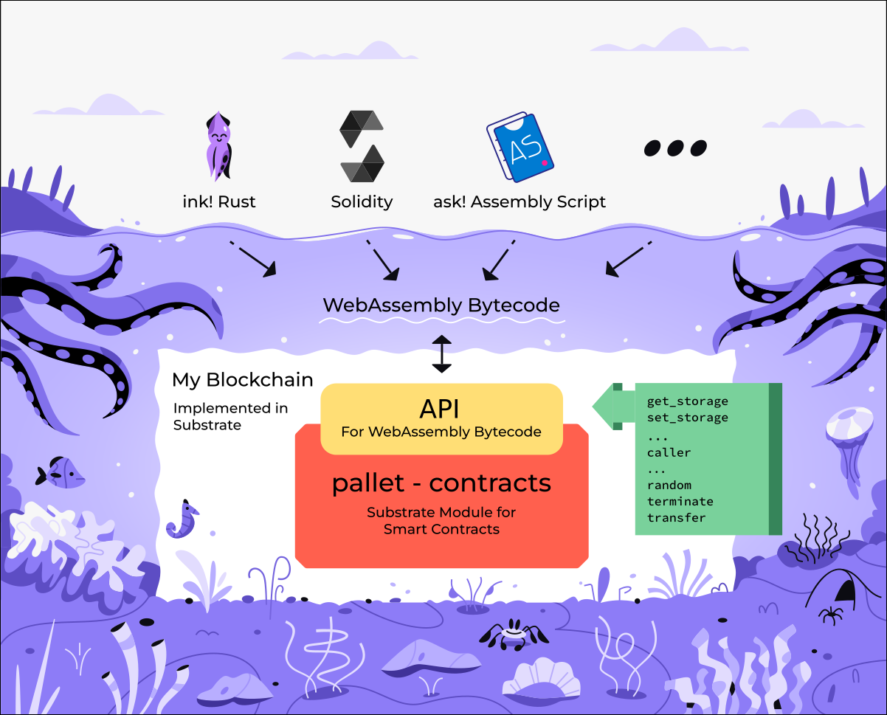

# ink!ternals

This document describes the architecture of ink!. The information
here targets those who want to understand or modify the inner
workings of this project.

In general we treat documentation as a first-class citizen.
All crates mentioned below should be documented really well.
You can find the crate documentation on docs.rs or for our
`master` branch under GitHub pages. So for `ink_lang` e.g.:

* [https://docs.rs/ink_lang/latest/ink_lang](https://docs.rs/ink_lang/latest/ink_lang) (latest)
* [https://paritytech.github.io/ink/ink_lang](https://paritytech.github.io/ink/ink_lang) (`master`)

ink! is composed of a number of crates that are all found in the
`crates/` folder. On a high-level those can be grouped as:

* [`lang`](https://github.com/paritytech/ink/tree/master/crates/lang):
  The ink! language itself.
* [`allocator`](https://github.com/paritytech/ink/tree/master/crates/allocator):
  The allocator used for dynamic memory allocation in a contract.
* [`engine`](https://github.com/paritytech/ink/tree/master/crates/engine):
  An off-chain testing engine, it simulates a blockchain environment and allows
  mocking specified conditions.
* [`env`](https://github.com/paritytech/ink/tree/master/crates/env):
  Serves two roles:
  * Exposes environmental functions, like information about the caller
    of a contract call, getting random entropy, or e.g. self-terminating the
    contract.
  * Provides the connection to the [`pallet-contracts`](https://github.com/paritytech/substrate/tree/master/frame/contracts),
    so anything that calls into the underlying execution engine of the smart contract.
    This includes getting and setting a smart contracts storage, as well
    as the mentioned environmental functions.
* [`metadata`](https://github.com/paritytech/ink/tree/master/crates/metadata):
  Describes the contract in a platform agnostic way, i.e. its interface
  and the types, its storage layout, etc.
* [`prelude`](https://github.com/paritytech/ink/tree/master/crates/prelude):
  Provides an interface to typical standard library types and
  functionality (like `vec` or `string`). Since contracts are run in a
  `no_std` environment we provide this crate as an entrypoint for accessing
  functionality of the standard library.
* [`primitives`](https://github.com/paritytech/ink/tree/master/crates/primitives):
  Utilities that are used internally by multiple ink! crates.
* [`storage`](https://github.com/paritytech/ink/tree/master/crates/prelude):
  The collections that are available for contract developers to put in
  a smart contracts storage.

An important thing to note is that the crates are primarily run in
a `no_std` environment.
Exceptions are `metadata` and `engine`, which cover use-cases that
are only relevant off-chain.

ink! contracts are compiled for a WebAssembly (Wasm) target architecture,
i.e. they are executed in a Wasm sandbox execution environment on the
blockchain itself ‒ hence a `no_std` environment.
More specifically they are executed by the [`pallet-contracts`](https://github.com/paritytech/substrate/tree/master/frame/contracts),
a module of the Substrate blockchain framework. This module takes ink!
smart contracts and runs them in a sandbox environment.

## Overview


The above diagram shows the main components of the ink! language
and how they interact. This pipeline is run once you execute
`cargo build` on an ink! smart contract.

The central delegating crate for the ink! eDSL is `ink_lang`.

In the `crates/lang/` folder you'll find three separate
crates on which `ink_lang` relies heavily:

* `ink_lang_macro`: The procedural macros, they take code annotated with e.g.
   `[ink::contract]` and forwards it to `ink_lang_ir`.
* `ink_lang_ir`: Defines everything the procedural macro needs in order to
   parse, analyze and generate code for ink! smart contracts.
* `ink_lang_codegen`: Generates Rust code from the ink! IR.

## Building ink! contracts

While you can build an ink! smart contract with just `cargo build`, we
recommend using our build tool [`cargo-contract`](https://github.com/paritytech/cargo-contract).
It automatically compiles for the correct WebAssembly target
architecture and uses an optimal set of compiler flags.

## Allocator

ink! smart contracts use a very simple bump allocator for dynamic
allocations. You can find it in `crates/allocator/`.

This allocator never frees allocated space, in case it runs out of
a defined limit of space to allocate it crashes.
This was done with the intention of reducing its complexity, which
would have resulted in higher costs for the user (due to increased
gas costs) and a lower transaction throughput. Freeing memory is
irrelevant for our use-case anyway, as the entire memory instance
is set up fresh for each individual contract call anyway.

## Nightly Rust features in ink!

We would like to get away from nightly features of Rust in ink!, so
that users can just use stable Rust for building their contracts.
At the moment we're still stuck with one nightly feature though:
[alloc_error_handler](https://github.com/rust-lang/rust/issues/51540).
It's needed because we use a specialized memory allocation handler,
the `ink_allocator` crate.

## Interaction with `pallet-contracts`

The Wasm blob to which an ink! contract is compiled is executed in
an execution environment named [`pallet-contracts`](https://github.com/paritytech/substrate/commits/master/frame/contracts)
on-chain.
This `pallet-contracts` is the smart contracts module of
[the Substrate blockchain framework](http://substrate.io/).

The relationship is as depicted in this diagram:



### Communication with the pallet
ink! uses a static buffer for interacting with `pallet-contracts`, i.e.
to move data between the pallet and a smart contract.
The advantage of a static buffer is that no gas-expensive heap allocations
are necessary, all allocations are done using simple pointer arithmetic.
The implementation of this static buffer is found in
[`ink_env/src/engine/on_chain/buffer.rs`](https://github.com/paritytech/ink/blob/master/crates/env/src/engine/on_chain/buffer.rs).

The methods for communicating with the pallet are found in [`ink_env/src/engine/on_chain/impls.rs`](https://github.com/paritytech/ink/blob/master/crates/env/src/engine/on_chain/impls.rs).
If you look at the implementations you'll see a common pattern of

* SCALE-encoding values on the ink! side in order to pass them as a slice
  of bytes to the `pallet-contracts`.
* SCALE-decoding values that come from the `pallet-contracts` side in order
  to convert them into the proper types on the ink! side, making them available
  for contract developers.

### The pallet API
The function signature of the `pallet-contracts` API functions is defined in
[`ink_env/src/engine/on_chain/ext.rs`](https://github.com/paritytech/ink/blob/master/crates/env/src/engine/on_chain/ext.rs).
You'll see that we import different versions of API functions, something
like the following excerpt:

```rust
#[link(wasm_import_module = "seal0")]
extern "C" {
    pub fn seal_get_storage(
        key_ptr: Ptr32<[u8]>,
        output_ptr: Ptr32Mut<[u8]>,
        output_len_ptr: Ptr32Mut<u32>,
    ) -> ReturnCode;
}

#[link(wasm_import_module = "seal1")]
extern "C" {
    pub fn seal_set_storage(
        key_ptr: Ptr32<[u8]>,
        value_ptr: Ptr32<[u8]>,
        value_len: u32,
    ) -> ReturnCode;
}
```

Smart contracts are immutable, thus the `pallet-contracts` can never change or remove
old API functions ‒ otherwise smart contracts that are deployed on-chain would break.

Hence there is this version mechanism. Functions start out at version `seal0` and for
each new released iteration of the function there is a new version of it introduced.
In the example above you can see that we changed the function `seal_set_storage` at
one point.

The prefix `seal` here is for historic reasons. There is some analogy to sealing a
contract. And we found seals to be a cute animal as well ‒ like squids!
