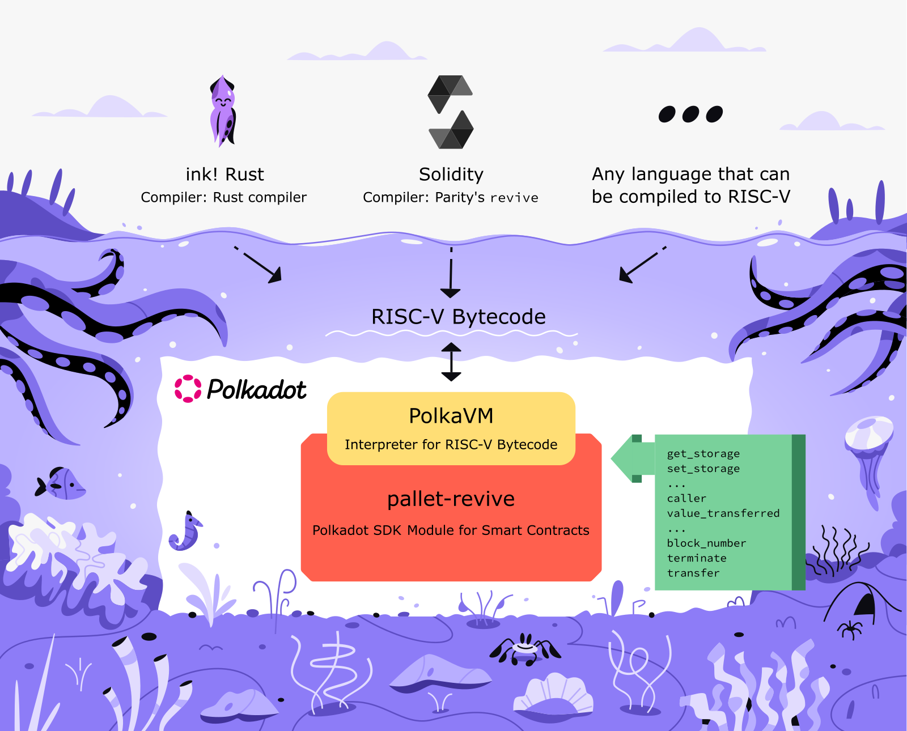

# ink! v6 Architecture

This document describes the architecture of ink!. The information
here targets those who want to understand or modify the inner
workings of this project.

In general, we treat documentation as a first-class citizen.
All crates mentioned below should be documented really well.
You can find the crate documentation on docs.rs or for our
`master` branch under GitHub pages. So for `ink` e.g.:

* [https://docs.rs/ink/latest/ink](https://docs.rs/ink/latest/ink) (latest published release)
* [https://use-ink.github.io/ink/ink](https://use-ink.github.io/ink/ink) (`master`)

ink! is composed of a number of crates that are all found in the
`crates/` folder. On a high-level those can be grouped as:

* [`ink`](https://github.com/use-ink/ink/tree/master/crates/ink):
  The ink! language itself.
* [`allocator`](https://github.com/use-ink/ink/tree/master/crates/allocator):
  The allocator used for dynamic memory allocation in a contract.
* [`env`](https://github.com/use-ink/ink/tree/master/crates/env):
  Serves two roles:
  * Exposes environmental functions, like information about the caller
    of a contract call or e.g. self-terminating the contract.
  * Provides the connection to the [`pallet-revive`](https://github.com/paritytech/polkadot-sdk/tree/master/substrate/frame/revive),
    so anything that calls into the underlying execution engine of the smart contract.
    This includes getting and setting a smart contracts storage, as well
    as the mentioned environmental functions.
* [`metadata`](https://github.com/use-ink/ink/tree/master/crates/metadata):
  Describes the contract in a platform-agnostic way, i.e. its interface
  and the types, its storage layout, etc.
* [`prelude`](https://github.com/use-ink/ink/tree/master/crates/prelude):
  Provides an interface to typical standard library types and
  functionality (like `vec` or `string`). Since contracts are run in a
  `no_std` environment we provide this crate as an entrypoint for accessing
  functionality of the standard library.
* [`primitives`](https://github.com/use-ink/ink/tree/master/crates/primitives):
  Utilities that are used internally by multiple ink! crates.
* [`storage`](https://github.com/use-ink/ink/tree/master/crates/storage):
  The collections that are available for contract developers to put in
  a smart contracts storage.
* [`engine`](https://github.com/use-ink/ink/tree/master/crates/engine):
  An off-chain testing engine, it simulates a blockchain environment and allows
  mocking specified conditions.
* [`e2e`](https://github.com/use-ink/ink/tree/master/crates/e2e):
  An end-to-end testing framework for ink! contracts. It requires a Polkadot SDK node
  which includes `pallet-revive` running in the background. The crate provides a
  macro that can be used
  to write an idiomatic Rust test that will in the background create transactions,
  submit them to the Polkadot SDK chain and return the state changes, gas costs, etc.

An important thing to note is that the crates are primarily run in
a `no_std` environment.
Exceptions are `metadata` and `engine`, which cover use-cases that
are only relevant off-chain.

ink! contracts are compiled to RISC-V bytecode for
[the PolkaVM interpreter](https://github.com/paritytech/polkavm).
This is how ink! smart contracts are executed on a blockchain:
they are uploaded to a blockchain that runs PolkaVM, PolkaVM then
interprets them.
As contracts are executed in a sandbox execution environment on the
blockchain itself we compile them to a `no_std` environment.
More specifically they are executed by the [`pallet-revive`](https://github.com/paritytech/polkadot-sdk/tree/master/substrate/frame/revive),
a module of the Polkadot SDK blockchain framework. This module takes ink!
smart contracts and runs them in a PolkaVM sandbox environment.
It also provides an API to smart contracts for anything a smart contract
needs: storing + retrieving data, calling other contracts, sending value,
fetching the block number, ….

## Overview


The above diagram shows the main components of the ink! language
and how they interact. This pipeline is run once you execute
`cargo build` on an ink! smart contract.

The central umbrella crate for the ink! eDSL is `ink`.

In the `crates/ink/` folder you'll find three separate
crates on which `ink` relies heavily:

* `ink_macro`: The procedural macros, they take code annotated with e.g.
   `[ink::contract]` and forward it to `ink_ir`.
* `ink_ir`: The ink! Intermediate Representation (IR). Defines everything
   the procedural macro needs in order to parse, analyze and generate code
   for ink! smart contracts.
* `ink_codegen`: Generates Rust code from the ink! IR.

The [`cargo-expand`](https://crates.io/crates/cargo-expand) tool can be used 
to display the Rust source code that `ink_codegen` generates for an ink! contract:

```ignore
cd ink/integration-tests/public/flipper/
cargo expand --no-default-features --target riscv64gc-unknown-none-elf
```

Ideally we'd use the target JSON file from PolkaVM for the `--target`,
but [`cargo-expand`](https://crates.io/crates/cargo-expand) doesn't
support JSON files for this parameter at the time of writing.

## Building ink! contracts

While you can build an ink! smart contract with just `cargo build`, we
recommend using our build tool [`cargo-contract`](https://github.com/use-ink/cargo-contract).
It automatically compiles for the correct PolkaVM target
architecture and uses an optimal set of compiler flags.

Ann approximation of the build command it will execute is:

```bash
cd ink/integration-tests/public/flipper/
cargo +nightly build
  --no-default-features
  --target ~/polkavm/crates/polkavm-linker/riscv64emac-unknown-none-polkavm.json
  -Zbuild-std="core,alloc"
```

You can also `build` or `check` a contract with this command.

## Allocator

ink! smart contracts use a very simple bump allocator for dynamic
allocations. You can find it in `crates/allocator/`.

This allocator never frees allocated space, in case it runs out of
a defined limit of space to allocate it crashes.
This was done with the intention of reducing its complexity, which
would have resulted in higher costs for the user (due to increased
gas costs) and a lower transaction throughput. Freeing memory is
irrelevant for our use-case anyway, as the entire memory instance
is set up fresh for each individual contract call.

## Unstable Rust features in ink!

We would like to get away from unstable features of Rust in ink!, so
that users can just use stable Rust for building their contracts.
At the moment we're stuck with nightly for the `ink_linting` crate though.
The two nightly features used there are `rustc_private` and `box_patterns`.
It's unclear when or if this feature will ever make it to stable.

We had a lot of issues when requiring users to use Rust nightly. Mostly
because there were regularly bugs in the nightly Rust compiler that
often took days to be fixed.
As a consequence we decided on having `cargo-contract` run
`cargo +stable build` with `RUSTC_BOOTSTRAP=1`. This is kind of a hack,
the env variable enables unstable features in the stable Rust toolchain.
But it enabled us to switch tutorials/guides to Rust stable.

One advantage is that users don't deal with an ever-changing nightly
compiler. It's easier for us to support. If you build a contract without
`cargo-contract` you will have to set this env variable too or use nightly.

## Interaction with `pallet-revive`

The PolkaVM blob to which an ink! contract is compiled is executed in
an execution environment named [`pallet-revive`](https://github.com/paritytech/polkadot-sdk/tree/master/substrate/frame/revive)
on-chain.
This `pallet-revive` is the smart contracts module of
[the Polkadot SDK blockchain framework](https://polkadot.com/platform/sdk).

The relationship is as depicted in this diagram:



### Communication with the pallet
ink! uses a static buffer for interacting with `pallet-revive`, i.e.
to move data between the pallet and a smart contract.
The advantage of a static buffer is that no gas-expensive heap allocations
are necessary, all allocations are done using simple pointer arithmetic.
The implementation of this static buffer is found in
[`ink_env/src/engine/on_chain/buffer.rs`](https://github.com/use-ink/ink/blob/master/crates/env/src/engine/on_chain/buffer.rs).

The methods for communicating with the pallet are found in [`ink_env/src/engine/on_chain/pallet_revive.rs`](https://github.com/use-ink/ink/blob/master/crates/env/src/engine/on_chain/pallet_revive.rs).
If you look at the implementations you'll see a common pattern of

* SCALE-encoding values on the ink! side in order to pass them as a slice
  of bytes to the `pallet-revive`.
* SCALE-decoding values that come from the `pallet-revive` side in order
  to convert them into the proper types on the ink! side, making them available
  for contract developers.

### The pallet API
The function signatures of host API functions are defined in
[`pallet-revive-uapi`](https://github.com/paritytech/polkadot-sdk/blob/master/substrate/frame/revive/uapi/src/host/riscv64.rs).
Smart contracts are immutable, thus the `pallet-revive` can never change or remove
old API functions ‒ otherwise smart contracts that are deployed on-chain would break.

So if there will be new versions of functions, they'll be introduced as new functions.
Typically with a version identified as postfix. So for each new released iteration of
a function there is a new version of it introduced.

## `Environment` Trait

You can use ink! on any blockchain that was built with the [Polkadot SDK](https://polkadot.com/platform/sdk)
framework and includes the [`pallet-revive`](https://github.com/paritytech/polkadot-sdk/tree/master/substrate/frame/revive)
module.
Polkadot SDK and `pallet-revive` only specifies some types as fixed,
but many are generic.
Chains built with Polkadot SDK can decide on their own which types they want
to use for e.g. the chain's block number or account id's.

The `Environment` trait is how ink! knows the concretes types of the chain
to which the contract will be deployed to.
Specifically, our `ink_env` crate defines a trait [`Environment`](https://use-ink.github.io/ink/ink_env/trait.Environment.html)
which specifies the types that are relevant for ink! to know.
By default, ink! uses the default Polkadot SDK types, the `ink_env` crate
exports an implementation of the `Environment` trait for that:
[`DefaultEnvironment`](https://use-ink.github.io/ink/ink_env/enum.DefaultEnvironment.html).

If you are developing for a chain that uses different types than the
Polkadot SDK default types you can configure a different environment in
the contract macro ([documentation here](https://use-ink.github.io/ink/ink/attr.contract.html#header-arguments)):

```rust
#[ink::contract(env = MyCustomTypes)]
```

__Important:__ If a developer writes a contract for a chain that deviates
from the default Polkadot SDK types, they have to make sure to use that
chain's `Environment`.

## Design decisions in `pallet-revive` that make it harder for ink!

Parity made a couple changes when forking `pallet-revive` from `pallet-contracts`, which 
make things harder/less performant for ink!. 

We are tracking these changes here because they make it easier to understand the codebase.
In the future, this list could also be used to improve the performance of ink! running
on `pallet-revive`, if Parity is open to it.

(1) Individual host functions were migrated to pre-compiles. Instead of being able to
just call into the host, these functions now have the performance overhead of calling
into another contract. Functions throughout ink! are affected by this.

(2) The `pallet-revive` pre-compiles don't support SCALE encoding, but instead expose 
only a Solidity interface. As ink! natively uses SCALE encoding we are required to
re-encode arguments into the bloated Solidity ABI encoding, as well as decode them.

(3) `pallet-revive` uses two types for a contracts balance: the generic `Balance` (which
is set in the chain configuration) and the Ethereum-native `U256`. Users of
ink! have to deal with both types as well. 

(4) In [#7164](https://github.com/paritytech/polkadot-sdk/pull/7164), Parity removed
most smart-contract-specific events: `Called`, `ContractCodeUpdated, CodeStored`,
`CodeRemoved`, `Terminated`, `DelegateCalled`,
`StorageDepositTransferredAndHeld`, `StorageDepositTransferredAndReleased`. 
The `Instantiated` event was brought back in a latter PR.

(5) `pallet-revive` included `revm` as a non-optional dependency. As ink! has to 
depend on `pallet-revive` for some features (e.g. sandboxed E2E testing), this 
results in over 75 more child dependencies having to be build now. This increased 
build times for sandboxed E2E tests significantly. 
[We proposed](https://github.com/paritytech/polkadot-sdk/pull/9689) putting anything 
`revm` behind a feature flag, but Parity is not open to it.

(6) The removal of host functions in favor of pre-compiles results in a loss of semantic
information why a contract call failed. Previously, if a contract call involving one of
the affected host functions (e.g. `take_storage`) contained too little Gas, the contract
would error with `OutOfGas`. As those functions are pre-compiles now and called like
other contracts, the contract call will now fail with `ContractTrapped` if too little
Gas is supplied. This makes it harder for users to debug and understand what caused the
call failure.
