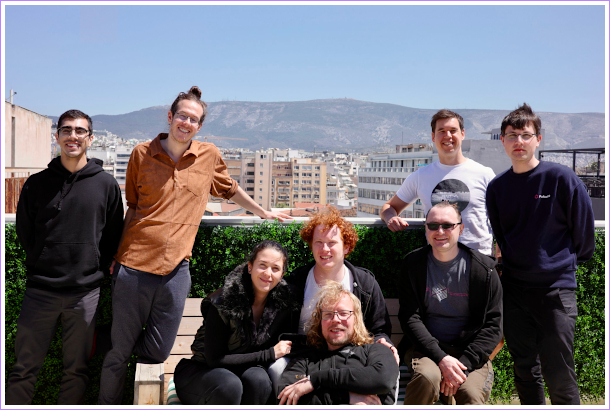

# Monthly Update: Parity Smart Contracts

## What is this?
Hey there reader 👋!

This is meant to be a high-level overview of the changes that have taken place as part of
Parity's Web Assembly (Wasm) smart contract efforts. These efforts include the [`ink!`](https://github.com/paritytech/ink)
programming language, the [`pallet-contracts`](https://github.com/paritytech/substrate/tree/master/frame/contracts) execution environment, the [`cargo-contract`](https://github.com/paritytech/cargo-contract)
development tool, and the [Canvas parachain](https://github.com/paritytech/cumulus/tree/master/polkadot-parachains/canvas-kusama). For anything UI related go check out the
[`contracts-ui` repository](https://github.com/paritytech/contracts-ui).

If these updates are too high-level for you you can always check out the release notes for
the various projects:
- [`ink!`](https://github.com/paritytech/ink/blob/master/RELEASES.md)
- [`pallet-contracts`](https://github.com/paritytech/substrate/blob/master/frame/contracts/CHANGELOG.md)
- [`cargo-contract`](https://github.com/paritytech/cargo-contract/blob/master/CHANGELOG.md)

If you're new here and aren't sure where to get started with ink! check out our
[guided tutorial for beginners](https://docs.substrate.io/tutorials/v3/ink-workshop/pt1/).

This was inspired by the [Polkadot Staking Progress Report](https://gist.github.com/kianenigma/aa835946455b9a3f167821b9d05ba376) ❤️.

## April 2022

### Releases 🆕

For ink! we released [v3.0.1](https://github.com/paritytech/ink/releases/tag/v3.0.1) with
minor bugfixes. Besides that we made a number of improvements to our examples ‒ mostly for
our [upgradeable contracts examples](https://github.com/paritytech/ink/tree/master/examples/upgradeable-contracts).

For `cargo-contract` we released [v1.1.1](https://github.com/paritytech/cargo-contract/releases/tag/v1.1.1) and
[v1.2.0](https://github.com/paritytech/cargo-contract/releases/tag/v1.2.0)
with bug fixes, a new sub-command `decode` and improved support for the `call` and
`instantiate` sub-commands.

For tutorials, development and testing we recommend using our `substrate-contracts-node`.
We issued the release [v0.13.0](https://github.com/paritytech/substrate-contracts-node/releases/tag/v0.13.0),
which is in sync with recent Substrate `master`. Pre-built binaries for the release are
available for Linux and Mac.

### Community Badges 🙌

We've added two versions of a community badge.

If you have a public repository with an ink! contract it would be awesome
if you could add one of those!

#### Normal Design

[](https://github.com/paritytech/ink)

```markdown
[](https://github.com/paritytech/ink)
```

#### Flat Design

[](https://github.com/paritytech/ink)

```markdown
[](https://github.com/paritytech/ink)
```

### Team Retreat in Athens 🇬🇷

We ‒ the developers working on ink!, Substrate's [`pallet-contracts`](https://github.com/paritytech/substrate/tree/master/frame/contracts),
and the [Contracts UI](https://github.com/paritytech/contracts-ui) ‒
went on a team retreat in April. We discussed our roadmap for the rest
of this year, as well as some technical designs of how we want to implement
e.g.  XCM in ink!. We're normally working across different time zones, with
some of us embracing the digital nomad lifestyle. Hence it was very
productive to gather together for a week.

We also did a little hackathon to do some dog-fooding: we've built a
Dapp that makes use of all components by the above teams. We plan
to open source it soon, stay tuned for that 😎.

There's a lot on the horizon and we're enthusiastic about the rest of this year!



### Spanish Twitter Space 🐦

[Hernando](https://github.com/hcastano) was a guest at the spanish Polkadot
Twitter Space. The space has been recorded:

* https://twitter.com/i/spaces/1MnGnkgmNdBJO
* https://twitter.com/i/spaces/1jMKgedkMgYJL

The network connection of the organizer had a bad day, hence it's two
recordings.

### StackExchange Public Beta

The [Substrate & Polkadot StackExchange](https://substrate.stackexchange.com/) site
has graduated from its private beta ‒ the site is now in public beta!

This means that the site is now indexed by search engines and can be
browser without any user account.

If you have any questions regarding ink! or smart contracts on Substrate this is
the place to be.

### Canvas Update

You may know that we were working on a common good smart contracts parachain
named Canvas. We've decided to put this project on hold. This gives us more
room to make ink! and the [`pallet-contracts`](https://github.com/paritytech/substrate/tree/master/frame/contracts)
as competitive as possible, as well as help parachain teams include those.
This is not to say that we'll never get back to Canvas, but as of right now
we're no longer working on this project.

## March 2022

### StackExchange Beta

We are participating in the Beta of [the Substrate StackExchange](https://substrate.stackexchange.com/) site!

If this StackExchange site gains traction it will be made available to the general public.
To reach this goal it's important to have the community engage there though.

Head over to [substrate.stackexchange.com](https://substrate.stackexchange.com/)
to ask us any questions (there is an `ink` tag)!

### ink! 3.0 🦑
The star of the show this month is the release of ink! 3.0:

- You can find the release notes [here](https://github.com/paritytech/ink/releases/tag/v3.0.0).
- We've also published a blog post with some more context:<br>
[ink! 3.0: Parity’s Rust-Based Language for WASM Smart Contracts Gets a Major Update](https://www.parity.io/blog/ink-3-0-paritys-rust-based-language-gets-a-major-update).

The team has been working on this release for a while. If you're a developer you're
probably aware of this thanks to the long list of release candidates (`v3.0.0-rcX`) we've
pushed out in preparation for the stable 3.0 release.

The main idea behind ink! 3.0 is that it's just Rust. The syntax is pretty much
identical, and all the tooling you know and love, such as `rust-analyzer` and Clippy,
just works.

Some other included changes worth highlighting:
- Reduced contract sizes for better performance in a parachain context.
- Support for cross-contract calls, making it easier to write complex applications.
- Trait support, allowing for a more Rusty development experience.

### cargo-contract 1.0
Alongside the release of ink! 3.0 we're also releasing [`cargo-contract`](https://github.com/paritytech/cargo-contract) in
its first stable version 1.0.
`cargo-contract` is a handy developer tool for building, testing, and deploying ink!
contracts.

Some notable updates in this release include:
- Support for uploading and calling contracts on a chain with `pallet-contracts`.
- Linting rules for ink! contracts, giving developers warnings about common errors.

### Delegate Call
Another update worth pointing out is the addition of `delegate_call`. What this allows is
a way for contracts to forward a call they received to another contract.

One use case for this is implementing a [Proxy Upgrade Pattern](https://docs.openzeppelin.com/upgrades-plugins/1.x/proxies) for smart contracts.

```
User ---- tx ---> Proxy ----------> Implementation_v0
                     |
                      ------------> Implementation_v1
                     |
                      ------------> Implementation_v2
```

This required some work in both `pallet-contracts` and ink!. Shoutout to the team over
at [Supercolony](https://supercolony.net/) for driving the development here!

We now have two example contracts for writing upgradeable contracts in ink!.
[See here](https://github.com/paritytech/ink/tree/master/examples/upgradeable-contracts)
for a deeper explanation.

### Workshop & Talk at EthDenver

[Hernando](https://github.com/hcastano) and [Achim](https://github.com/achimcc) went to EthDenver to
give a workshop and talk regarding ink! on the Substrate stage!

The recording is available [here](https://www.youtube.com/watch?t=7122&v=NrG3co6UWEg).
