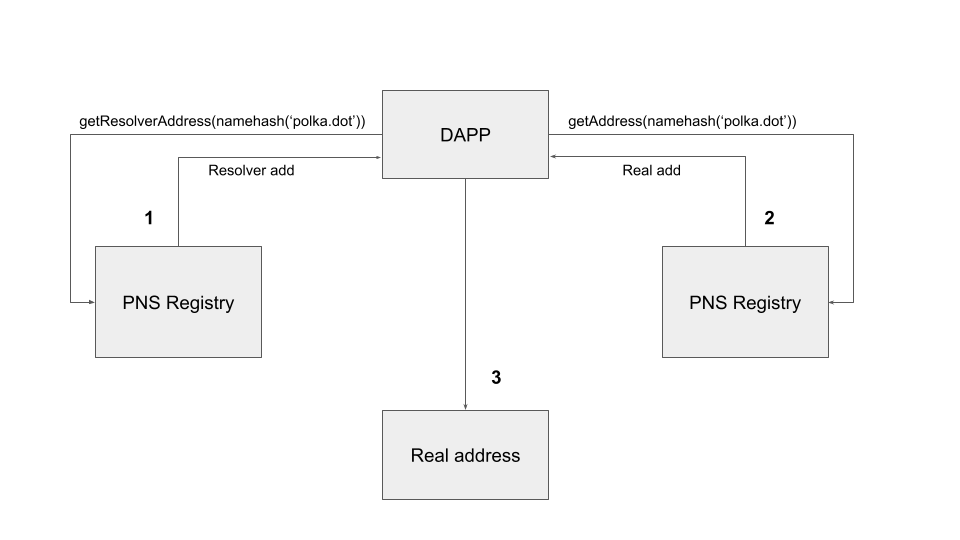

# DNS Smart contract

The DNS smart contract is our showcase for executing other smart contracts on-chain.

   

> This is a port from the blog post's ink! 1.0 based version of the contract to ink! 2.0.

Domain name service contract inspired by
    [this blog post on medium](https://medium.com/@chainx_org/secure-and-decentralized-polkadot-domain-name-system-e06c35c2a48d).

### Description
The main function of this contract is domain name resolution which refers to the retrieval of numeric values corresponding to readable and easily memorable names such as "polka.dot" which can be used to facilitate transfers, voting and DApp-related operations instead of resorting to long IP addresses that are hard to remember.
 

## Functionalities provided: 

- Registration of a new Domain Name
- Transfer the (already exsiting) owner to new Address
- Change the Domain Name

### Other functionalities to be implemented: 
- Transfer bidding

> __Note:__ 
   > Depending on your Substrate version you might encounter [a ink_lang dependency error](https://github.com/paritytech/ink/issues/506) which is yet to address. 
  

